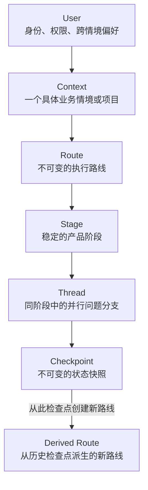
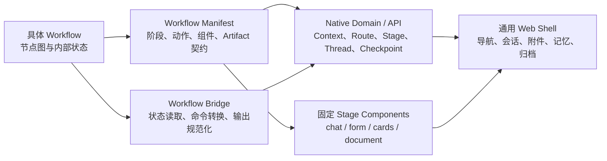
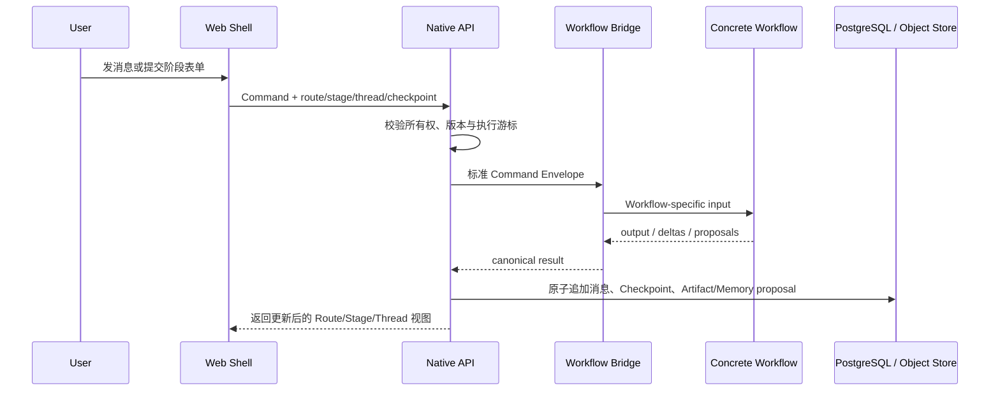

# 原生 Workflow Web UI 母模板设计

日期：2026-07-15
状态：已完成分段设计确认，等待书面规格终审

## 1. 范围与定位

本设计的实施目标是 Web UI 母模板：

- 母模板：`~/Desktop/Web_related/_template`
- 发行编译器：`~/Polarisor/PolarUI/scripts/export-release.mjs`
- 参考发行版：`~/Desktop/Server/TaoCi`

TaoCi 只用于提取已经验证过的问题和产品需求，不是本轮重构对象。新母模板导出的每个 Web 发行版绑定一个 workflow。PolarFlow IDE 的多 workflow 工作区是后续提案，已记录到 PolarFlow Roadmap，本轮不开发。

## 2. 背景与问题

当前母模板以 LibreChat 为公网入口和会话底座，再叠加 Polar API、workflow、分层记忆和产品 UI。随着产品能力增加，LibreChat 已从“可复用底座”变成结构性限制：

- 产品身份与 LibreChat 身份并存，形成双认证状态机。
- `@polar.local`、共享 JWT、容器与宿主机验签制造了脆弱耦合。
- 产品路由、登录、导航和阶段页面需要深度 Fork 上游客户端。
- LibreChat 的 conversation/project 模型无法原生表达用户、情境、阶段、路线和检查点。
- 构建、静态资源发布、容器缓存与上游升级成本不断上升。

因此母模板不再以“聊天产品套壳”为中心，而改为“workflow 产品运行壳”。

## 3. 目标与非目标

### 3.1 目标

- 新建原生 `polar-web` 公网容器，接管 UI、认证、产品 API、对话、阶段投影和 workflow 适配。
- 原生支持 `User → Context → Route → Stage → Thread → Checkpoint`。
- 支持阶段自由浏览、未来阶段提前讨论、阶段内多线程探索和历史检查点派生新路线。
- 保持产品阶段与 `flow.json` 内部状态解耦。
- 每个发行版可注册专属阶段组件，但不能通过递归配置生成任意页面。
- 以真实生产容器和真实浏览器完成发布验收。

### 3.2 非目标

- 本轮不开发 PolarFlow IDE。
- Web 发行版本轮不同时承载多个 workflow。
- 不在母模板中保留 LibreChat 运行时、认证、Mongo 会话或前端 Fork。
- 不建立任意 HTML、脚本表达式或递归布局 DSL。
- 不修改 TaoCi 的现有产品实现；具体发行版迁移另立计划。

## 4. 选定方案

采用“原生 Workflow Web 模板”：

```text
Browser
  → polar-web（唯一公网容器）
      ├── Web Shell
      ├── Identity
      ├── Conversation Domain
      ├── Workflow Bridge
      └── Artifact Service
  → PostgreSQL
  → Object Storage Adapter
  → PolarFlow Runtime（内部 HTTP 契约）
```

被否决的方案：

1. 只替换前端、保留 LibreChat 后端：仍保留双认证和会话耦合。
2. Web、workflow 与 IDE 一体化：超出当前范围，并会把开发工具与产品运行时重新缠绕。

## 5. 运行与部署边界

`polar-web` 是唯一公网入口，同源提供静态前端和产品 API。PostgreSQL、对象存储与 PolarFlow Runtime 是内部依赖，不直接暴露公网。

基础技术边界：

- 前后端统一使用 TypeScript。
- Web 使用 React + Vite，提供简约、克制、可访问的默认视觉系统。
- API 使用 Node.js 22+；具体 HTTP 框架是实施细节，但必须支持 schema 校验、HttpOnly session、SSE 和结构化日志。
- PostgreSQL 是产品状态唯一事实源。
- 文件通过对象存储适配器管理；开发环境可使用本地 volume，生产环境可切换 S3 兼容存储。
- PolarFlow 只执行 workflow，不拥有 Web 用户、URL、页面状态或产品数据库写权限。

建议目录：

```text
_template/
├── apps/
│   ├── web/
│   └── api/
├── packages/
│   ├── domain/
│   ├── workflow-contract/
│   ├── product-sdk/
│   └── ui/
├── db/
│   ├── schema/
│   └── migrations/
├── scripts/
│   └── import-librechat/
├── product.manifest.ts
├── Dockerfile
└── compose.yml
```

## 6. 领域模型

### 6.1 User

用户身份、权限，以及经过明确确认、允许跨情境使用的长期信息。

### 6.2 Context

一个独立问题空间，例如一个项目、申请对象或决策。不同 Context 默认数据隔离。

### 6.3 Route

workflow 状态演进的一条不可变谱系。已有 Route 的状态只能向前追加。用户在非当前头部 Checkpoint 上执行“采纳”或其他会改变共享状态的命名动作时，系统创建新 Route；原 Route 保留。仅查看历史或发送仍属 Thread 局部的消息不会创建 Route。

### 6.4 Stage

稳定产品阶段，由发行版 manifest 定义。一个 Stage 可以映射多个内部 workflow 状态。所有 Stage 始终可见、可进入、可提前创建讨论线程；依赖前置结果的正式动作在未就绪时不可执行。

### 6.5 Thread

某个 Stage 内的独立讨论分支。同一 Stage 可以有多个 Thread，用于并行讨论不同子问题。Thread 的结论默认保留在线程内，不自动写入共享 Context 或 Route 状态。

### 6.6 Message 与 Artifact

消息与产物记录不可静默覆盖。编辑通过新版本表达。附件正文存放于对象存储，数据库保存所有权、哈希、状态和引用关系。

### 6.7 Checkpoint

每次受控动作完成后生成的不可变状态快照，至少记录父 Checkpoint、命令、输入版本、workflow cursor、阶段投影、被采纳的记忆变更和产物引用。

## 7. 分支与状态不变量

系统区分两类分支：

- Thread Branch：同一 Stage 内的对话探索，不直接改变 workflow Route。
- Route Branch：从历史 Checkpoint 派生的 workflow 新路线。

核心不变量：

1. 状态事件只追加，不反向修改旧 Checkpoint。
2. 点击旧 Stage 或旧 Checkpoint 只改变浏览位置。
3. 在旧 Checkpoint 上提交会改变共享状态的命名动作时，自动创建新 Route；Thread 局部消息不触发 Route 派生。
4. Thread 结论只有通过“采纳到当前路线”这一命名动作，才可生成新的 Stage 状态与 Checkpoint。
5. 不提供通用 `set_stage` 或任意状态写入接口。
6. 用户、Context、Route、Stage、Thread 的所有读写都必须进行所有权与 scope 校验。

## 8. 分层记忆

记忆分为五层：

| 层 | 用途 | 写入规则 |
| --- | --- | --- |
| User Memory | 跨情境长期信息 | 必须显式确认 |
| Context Facts | 情境共享事实 | 版本化、受控采纳 |
| Route State | 某条路线的执行状态 | 仅命名动作推进 |
| Stage State | 阶段产物与完成条件 | 事务提交并生成 Checkpoint |
| Thread Memory | 探索性对话上下文 | 默认仅线程可见 |

模型或 workflow 可以提出变更，但不能绕过确认和 scope 规则直接写共享层。

## 9. 产品 Manifest 与 UI 组合

母模板提供固定产品骨架：

- 顶部产品栏；
- 左侧 Context、Route、Checkpoint 与 Stage 导航；
- 中央 Stage Workspace；
- 右侧或移动端抽屉式 Thread 区域。

`product.manifest.ts` 可以声明：

- 品牌、领域名词和默认简约主题 token；
- 稳定 Stage 定义和内部 workflow 状态映射；
- `component_key`、命名动作、完成条件和前置条件；
- workflow endpoint 和契约版本；
- 发行版启用的能力标记。

模板 Component Registry 至少提供：

- `generic_chat`
- `structured_form`
- `card_selection`
- `document_workspace`

发行版可以注册代码实现的专属组件。manifest 不允许任意 HTML、递归布局树、脚本表达式或直接 workflow state 写入。

视觉策略：母模板仅提供简约默认风格和可访问性基线；每个发行版的品牌视觉在发布设计时单独确认。

## 10. 身份与认证

母模板使用一套自有身份系统：

- 正式用户通过邮箱注册并完成验证。
- 登录标识支持邮箱或用户名。
- 管理员后台创建用户时可以按权限跳过邮箱验证。
- 浏览器使用同源 HttpOnly session cookie；生产环境必须启用 Secure，localhost 开发环境允许关闭 Secure。
- session 失效时保留本地未提交草稿；重新登录后恢复原 Context、Route、Stage 和 Thread URL。
- 不再创建 `@polar.local` 内部用户，不再共享 LibreChat JWT。

开发与全链路测试使用 Mailpit；真实发布烟测使用专用 QA 邮箱或可撤销凭据，不使用个人邮箱主密码。

## 11. Workflow 契约与数据流

浏览器只能提交消息或命名动作。`polar-web` 负责身份、所有权、动作权限、并发版本和事务校验。

Command Envelope 至少包含：

```text
contract_version
command_id
context_id
route_id
stage_key
thread_id
expected_checkpoint_version
message 或 named_action
memory_snapshot
```

Workflow Result Envelope 至少包含：

```text
reply_events
interrupt
memory_proposals
stage_signal
artifact_proposals
workflow_cursor
diagnostics
```

处理顺序：

1. API 验证 session、所有权、Stage 与 action 权限。
2. 校验 `expected_checkpoint_version`，创建幂等 command/run。
3. 组装五层上下文快照，经 Workflow Bridge 调用 PolarFlow。
4. Bridge 校验返回 schema、scope、阶段迁移和产物权限。
5. 完整结果通过后，在单个数据库事务中追加消息、workflow event、提案、产物元数据和 Checkpoint。
6. 更新 Route/Stage projection，并通过 SSE 推送最终视图。

PolarFlow 不直接连接产品数据库。内部 workflow 状态通过 manifest 映射为稳定产品 Stage；内部节点调整不得改变产品 URL 和历史记录语义。

### 11.1 最终领域结构



这个层级中“浏览”和“执行”是两件事。用户可以自由查看任意 Stage 和 Checkpoint，但浏览不移动 execution cursor。Cursor 只能由 Workflow command 按合法状态迁移向前推进。同一 Stage 可创建多个 Thread，用于并行讨论不同问题；从历史 Checkpoint 修改共享状态时，系统不覆盖原路线，而是创建 Derived Route。

### 11.2 Workflow 如何套入通用模板



模板不解析、也不递归渲染 Workflow 内部节点图。具体 Workflow 只通过两个稳定注入点进入模板：

1. **Manifest 是静态产品契约**：定义产品名称、Stage 投影、合法动作、固定组件 key 和 Artifact 类型。同一模板换上不同 Manifest，就得到不同的单 Workflow 产品。
2. **Workflow Bridge 是动态执行契约**：将通用 Command Envelope 转换为具体 Workflow 输入，再把返回值规范化为 `reply_events`、`stage_signal`、`artifact_proposals`、`memory_proposals` 和 `workflow_cursor`。
3. **Native Domain 是最终裁决者**：校验用户所有权、execution cursor、阶段迁移、并发版本和提案权限；Workflow 不能直接写产品数据库。
4. **Web Shell 只渲染有限组件集**：`generic_chat`、`structured_form`、`card_selection`、`document_workspace`。这保证 Workflow 可替换，但产品层级、URL、历史语义和页面布局始终稳定。

因此，“自由”被放在 Workflow 的执行逻辑和数据 IO 中，“稳定”被放在 Web 产品模型与固定组件中。这避免了无限递归 UI，也避免了每换一个 Workflow 就重写认证、会话、附件、记忆和归档能力。

### 11.3 命令执行与原子持久化



一次 Workflow 运行只产生“候选结果”。只有当 Bridge schema 校验、领域不变量校验和乐观并发校验全部通过后，API 才会在一个事务中追加消息、事件和 Checkpoint。任一环失败都不会留下“消息已显示但状态没推进”的半成品。

### 11.4 最终注入与发行契约

具体 Workflow 的源码目录必须同时包含可执行图和静态产品契约：

```text
workflows/<workflow-id>/
├── <workflow-id>.json       # PolarUI headless runtime 可实际执行的图
└── product.manifest.json    # 产品投影，不包含页面结构 DSL
```

四层契约固定如下：

| 层 | 输入 | 输出与责任 |
| --- | --- | --- |
| Source Manifest | `contract_version`、产品词汇、`workflow.id`、运行 endpoint、Stage、action、固定 `component_key` | Workflow 作者声明的静态产品投影；导出器不得臆造 Stage、action 或 endpoint |
| Release Compiler | Workflow 图、Source Manifest、release id | 冻结 `workflow/snapshot.json`、`product.manifest.json`、`site.manifest.json`、`site.config.json`、memory schema、executor 清单与校验和；只允许将 `product.id` 改为 release id |
| Workflow Bridge | Native Command Envelope 与五层只读快照 | 发送 workflow-specific HTTP input；规范化 reply、Stage signal、Artifact/Memory proposal、interrupt 与 cursor；非法/超时结果 fail closed |
| Native Domain/API | Bridge 候选结果、当前 execution cursor 与 checkpoint version | 裁决权限、幂等、并发、合法前进与原子持久化；Workflow 无产品数据库写权限 |

运行 endpoint 是 Source Manifest 的发行契约，编译时保持不变；容器网络需要改写地址时，只能通过部署环境 `WORKFLOW_ENDPOINT_OVERRIDE` 覆盖，不得改写冻结的 Manifest。发行版中的 `workflow/snapshot.json` 必须与 `site.manifest.json.workflow_checksum` 一致，并可由声明的 executor 集合在受管 Workflow Runtime 中执行。

Bridge 的规范 Command Envelope 固定包含 `contract_version`、`command_id`、用户/Context/Route/Stage/Thread 标识、命令类型、期望 checkpoint version、历史与五层 memory snapshot。规范结果固定包含 `reply_events`（当前 HTTP v1 以单一 `reply` 兼容）、`stage_signal(s)`、`artifact_proposals`、`memory_proposals`、`interrupt`、`workflow_cursor` 与 `diagnostics`。兼容字段只能在 Bridge 内转换，不能泄漏到 Native Domain。

## 12. 并发、幂等与错误处理

- 每个命令使用唯一 `command_id`，重试不得重复写入消息或 Checkpoint。
- 提交携带期望 Checkpoint 版本；版本冲突返回 409，并展示刷新、另开 Thread 或从旧 Checkpoint 派生 Route 的选择。
- PolarFlow 不可用时，历史、阶段产物和已完成状态保持可读；命令记录为可重试失败。
- 流式片段可以临时展示，但只有完整结果校验通过后才提交 assistant message 和状态事件。
- 非法 workflow 输出必须 fail closed；详细诊断进入管理员日志，用户端不暴露 prompt、secret 或内部堆栈。
- Artifact 使用 `pending / ready / failed` 状态，可独立重试，不回滚已完成对话。
- 发布采用增量数据库迁移与健康检查；新容器验证成功后才切换入口，旧镜像和备份保留至验收结束。

## 13. LibreChat 历史数据

母模板核心运行时不包含 LibreChat。为已有发行版提供可选的一次性迁移 CLI：

1. 以只读方式读取 LibreChat Mongo 和附件目录。
2. 支持 dry-run、映射报告、重复执行检测和失败明细。
3. 保留原 conversation ID、消息角色、时间和附件校验哈希。
4. 导入为 `read_only=true` 的历史档案。
5. 旧线程可以查看和展示，但不能继续写入；新讨论必须创建原生 Thread。
6. 导入完成后不依赖 LibreChat 容器继续运行。

具体发行版是否执行迁移，由该发行版的独立迁移计划决定。

## 14. 测试与发布门禁

发布必须通过以下门禁：

1. **静态契约**：manifest、Stage 映射、组件 key、命名动作与 workflow envelope schema。
2. **领域不变量**：状态只追加、路线派生、线程隔离、显式采纳、跨用户隔离。
3. **数据库与认证集成**：真实 PostgreSQL migration；Mailpit 邮箱注册验证；邮箱/用户名登录；管理员建号。
4. **Workflow 契约**：正常、interrupt、超时、非法结果、重复命令与并发冲突。
5. **浏览器旅程**：桌面和 390px 移动端覆盖 Stage 自由导航、未来 Stage 讨论、Thread 分支、采纳、推进、回溯和 Route 派生。
6. **迁移测试**：固定 LibreChat fixture 的 dry-run、导入、幂等与只读限制。
7. **生产容器**：Playwright 必须访问实际发布端口，验证资源哈希、刷新恢复和 LibreChat 运行依赖为零。

强制全链路场景：

```text
注册新邮箱
→ Mailpit 验证
→ 登录
→ 创建 Context
→ 进入任意 Stage
→ 同阶段创建两个 Thread
→ 采纳一个 Thread 结论
→ 推进 Checkpoint
→ 回溯旧 Checkpoint 并派生新 Route
→ 刷新页面后完整恢复
```

不得以源码单测通过、`client/dist` 正常或另起的临时测试服务器代替实际生产容器验收。

## 15. 导出链变化

`export-release.mjs` 后续应从原生母模板生成发行版，并完成：

1. 复制原生 `polar-web` 脚手架。
2. 编译并校验 `product.manifest`。
3. 注入品牌、Stage 投影、组件注册和单一 workflow endpoint。
4. 生成数据库迁移、容器配置和发布元数据。
5. 构建实际生产镜像并执行上述门禁。

导出链不再抓取、Patch、构建或发布 LibreChat。

## 16. 成功标准

- 新发行版在没有 LibreChat、Mongo 和 `@polar.local` 的环境中完整运行。
- UI 能自然表达用户、情境、路线、阶段、线程与检查点。
- 用户可以自由浏览阶段、提前讨论、并行开线程、显式采纳和从历史派生路线。
- workflow 内部状态调整不破坏产品 Stage、URL 和历史数据。
- 邮箱注册、登录、对话、分支、回溯、刷新恢复和真实容器发布均有自动化证据。
- IDE 多 workflow 能力仍只存在于 PolarFlow Roadmap，不进入当前 Web UI。
