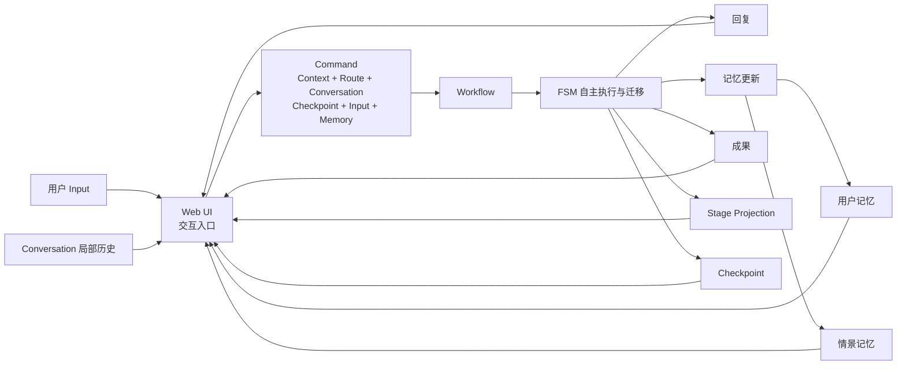
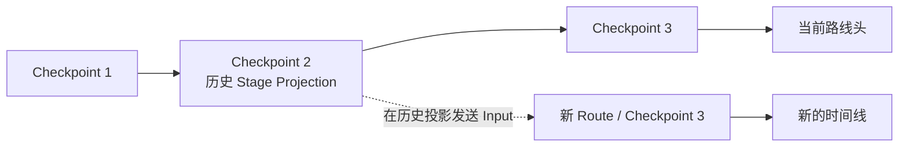

# Native Workflow Web 核心输入与记忆交互设计

日期：2026-07-17
状态：产品与 UI 已确认，尚未进入实施

## 1. 设计目标

Native Workflow Web 是任意 Workflow 的通用交互与记忆管理界面。

本设计解决当前 Stage-first 页面中的根本问题：用户输入被隐藏在“阶段讨论”抽屉里，首次使用还必须先创建工作空间和讨论。新的页面必须让用户进入产品后立即输入，同时保持 Context、Conversation、Route、Checkpoint、Memory 和 Artifact 的完整领域能力。

本设计只完成产品与 UI 对齐，不包含代码实施。

## 2. 核心原则

### 2.1 Workflow 是根本

Workflow 拥有 FSM、执行节点、状态迁移、重试、中断和完成条件。Web UI 不选择 Stage，不提供 `setStage`，也不通过页面路由控制 Workflow 状态。

### 2.2 Stage 只是只读投影

Stage 是 Workflow 针对人类理解返回的状态投影：

- Stage 名称、数量、顺序和状态全部由 Workflow/Bridge 返回；
- Web 不内置任何业务 Stage 名称；
- Stage 不拥有 Input、Conversation 或 URL；
- 点击 Stage 只定位到产生该投影的 Checkpoint；
- 历史 Stage Projection 只读；
- 从历史投影发送新的 Workflow Input 会创建新时间线，而不是修改历史。

### 2.3 Web UI 只负责交互与记忆管理

Web UI 的核心职责是：

1. 提供持续可见的用户输入入口；
2. 管理 Context 和 Conversation；
3. 组织用户记忆、情景记忆和局部对话历史；
4. 展示 Workflow 回复、成果、运行反馈和只读状态投影；
5. 提供版本归档与新时间线入口。

### 2.4 Context 是领域要求，不是交互门槛

每次 Workflow 运行必须属于一个 Context，但用户不需要先创建或命名 Context。第一条 Input 足以让系统自动建立 Context、初始 Route、Checkpoint 和主 Conversation。

Context 的使命是形成可复用的公共记忆范围，最大限度减少用户重复输入。

### 2.5 Input 是 Workflow 的核心激励源

自然语言 Input 可以直接驱动 Workflow。Agent 根据 FSM 自行决定是否迁移状态以及迁移到哪里。Manifest action 只能作为快捷意图、结构化输入或必要确认，不能成为用户手动控制状态机的闸门。

## 3. 领域边界



### 3.1 Context

Context 是一个公共记忆范围。它包含同一情景下持续有效的事实、材料、约束和成果引用。多个 Conversation 和 Route 可以共享同一 Context Memory。

Context 默认由首条 Input 自动建立并由 Agent 自动命名。用户可以随时重命名。

### 3.2 Conversation

Conversation 是一个局部交互通道，保存局部消息历史和草稿。它不是 Workflow 状态分支，也不是第三层公共记忆。

同一 Context 可以有多个 Conversation。它们共享用户记忆与情景记忆，但局部消息历史相互隔离。

### 3.3 Route

Route 是 Workflow 状态演进的一条时间线。Route 内的 Checkpoint 只追加，不反向改写。

从历史 Checkpoint 继续输入时创建新的 Route。新 Route 与原 Route 地位相同，只记录来源 Checkpoint 用于溯源，不具有特殊身份。

### 3.4 Checkpoint

Checkpoint 是不可变的 Workflow 状态快照，也是 Branch 的唯一锚点。Stage 名称不能充当 Branch 锚点，因为同一个 Stage 可能对应多个 Checkpoint。

Checkpoint 至少保存：

- Workflow 状态与版本；
- 当时的 Stage Projection 完整快照；
- 当时可复现运行所需的记忆引用或快照；
- 成果引用；
- 父 Checkpoint 与来源 Command。

### 3.5 Stage Projection

Stage Projection 是由 Workflow 返回的可选、只读、自描述数据。Web 只负责通用渲染，不参与定义和迁移。

建议最小结构：

```text
stage_projection:
  revision
  items[]:
    key
    label
    status
    checkpoint_id?
    summary?
```

`checkpoint_id` 在对应历史快照已经存在时提供，用于打开准确的历史版本；尚未发生的投影项可以省略。`revision` 用于说明投影来自哪个 Workflow 定义版本。

### 3.6 Artifact

Artifact 是 Workflow 结果。它先在对话因果链中出现，同时同步到成果区域。Artifact 可以携带 Workflow 自己提供的 Stage 或 Checkpoint 元数据，但不因此改变 Input 的归属。

## 4. 两层记忆模型

系统只定义两层公共记忆。Conversation 历史和 Workflow Checkpoint 不作为额外记忆层。

### 4.1 用户记忆

用户记忆跨 Context 生效，用于建立对用户的长期模型。

LLM 提取提示词必须明确要求：

> 是对用户的建模，能揭示用户的习惯、特点、taste。

适合记录：

- 稳定表达习惯；
- 长期偏好；
- 决策风格；
- taste；
- 跨情景持续有效的个人特点。

### 4.2 情景记忆

情景记忆只在当前 Context 内生效，用于建立对本情景的持续模型。

LLM 提取提示词必须明确要求：

> 是对本情景的建模，是本情景的本质信息；对之后处理具体问题有持续性帮助或约束。

适合记录：

- 情景目标和边界；
- 已确认的本质事实；
- 持续性约束；
- 后续任务需要复用的决定；
- 对全部 Conversation 或 Route 有帮助的材料与成果引用。

### 4.3 记忆元数据

每条记忆必须保存并可展示：

- 来源；
- 创建时间和更新时间；
- 版本；
- 影响范围；
- 证据引用；
- 当前状态。

默认允许 Agent/Workflow 自动积累记忆。用户可以查看、修正和删除。冲突、歧义或高影响信息通过 Workflow Interrupt 请求用户确认，不能静默覆盖既有记忆。

记忆修正生成新版本，删除使用可审计的失效记录，不修改旧版本。

## 5. 核心页面层级

选定方案为“对话主轴 + Context Memory 侧栏”。Stage Workspace 不再占据页面主结构。

### 5.1 桌面端

```text
┌─────────────────────────────────────────────────────────────┐
│ 产品身份                                      同步 / 版本   │
├──────────────┬──────────────────────────┬───────────────────┤
│ Context 列表 │ 当前 Context             │ 记忆 / 成果 / 运行│
│              │ 当前 Route / 版本        │                   │
│              │ Conversation 切换 + 新建 │ 双层记忆摘要      │
│              │                          │ 成果摘要          │
│              │ 对话时间线               │ Stage Projection  │
│              │ Workflow 反馈            │ 运行详情          │
│              │                          │                   │
│              │ 常驻 Input Composer      │                   │
└──────────────┴──────────────────────────┴───────────────────┘
```

主次关系：

1. 对话时间线和 Input 是主轴；
2. Context 列表提供公共记忆范围切换；
3. 右侧默认显示情景记忆，可切换用户记忆、成果和运行；
4. Stage Projection 只出现在运行信息中；
5. 版本归档通过独立只读界面进入。

### 5.2 移动端

移动端只保留一个主滚动区域：Conversation。

始终可见：

- 当前 Context；
- 当前 Conversation；
- 消息与 Workflow 反馈；
- 固定在安全区上方的 Input Composer。

进入抽屉或全屏层：

- Context 列表；
- Conversation 列表与管理；
- 用户记忆、情景记忆、成果与运行状态；
- 完整 Stage Projection；
- 版本归档。

移动端控件触控区域不得小于 44×44px，固定 Composer 必须为底部安全区预留空间。

### 5.3 常驻、折叠和抽屉

| 层级 | 内容 |
| --- | --- |
| 始终常驻 | 当前 Context、当前 Conversation、消息流、Input Composer、当前执行状态 |
| 二级但可见 | 桌面端双层记忆摘要、成果数量、Workflow 状态投影 |
| 按需折叠 | 快捷意图、低频运行细节、已完成状态摘要 |
| 抽屉或详情页 | 移动端记忆/成果/运行、完整 Conversation 管理、记忆来源与版本、版本归档 |

## 6. 空状态与首次 Input

### 6.1 零 Context

用户第一次进入页面时直接看到：

```text
你现在想处理什么？
[ 描述问题、目标或粘贴材料……                 发送 ]
```

用户不需要理解 Context、Route、Stage 或 Conversation。

首次发送执行一个统一的 Start Command：

1. 根据 Input 自动建立 Context；
2. 建立初始 Route 和 Checkpoint；
3. 建立主 Conversation；
4. 注入可用的用户记忆；
5. 交给 Workflow 执行；
6. Agent 生成 Context 和 Conversation 名称；
7. 返回回复、记忆更新、成果、Checkpoint 和可选 Stage Projection。

初始化过程中页面显示“正在理解并建立工作情景”，不显示临时命名表单，也不暴露半成品 Context。

初始化失败时保留完整 Input 和附件，提供重试，并避免留下用户可见的空 Context。

### 6.2 Context 已存在但没有 Conversation

页面直接渲染一个虚拟主 Conversation 和 Composer。首次发送时静默创建真实 Conversation 与 Command，不要求用户先输入标题。

### 6.3 手动创建 Context

手动创建仍作为次级能力存在，适合用户希望先命名、导入材料或规划多个情景，但绝不是默认路径。

## 7. 多 Conversation

### 7.1 默认主 Conversation

每个 Context 的默认交互入口是主 Conversation。没有真实 Conversation 时仍显示完整输入体验，首次发送后再创建。

### 7.2 新建 Conversation

用户通过当前 Conversation 旁的 `＋` 新建 Conversation：

- 立即进入空 Conversation；
- 不要求先填写标题；
- 首轮 Input 完成后由 Agent 自动命名；
- 用户可以随时重命名；
- 新 Conversation 共享用户记忆和情景记忆；
- 局部消息历史与草稿相互隔离。

“新建讨论”不能成为首次使用门槛，也不作为首屏主要 CTA。

### 7.3 Conversation 切换器

桌面端在对话标题旁提供切换器和 `＋`。移动端使用同一入口打开全屏列表。

每个列表项显示：

- Conversation 名称；
- 最近活动时间；
- 所属 Route；
- 当前状态；
- 重命名、查看信息和归档入口。

### 7.4 从历史继续

用户在历史 Checkpoint Projection 中发送 Input 时：

1. 原历史保持只读；
2. 系统以该 Checkpoint 为起点创建同等地位的新 Route；
3. 在新 Route 中创建新的 Conversation；
4. 第一条 Input 直接交给 Workflow；
5. 新 Route 与新 Conversation 均可由 Agent 自动命名，不增加前置表单。

## 8. 重命名

Context 和 Conversation 都支持重命名。

### 8.1 Context 重命名

入口：

- 左侧 Context 列表项的更多菜单；
- 当前 Context 标题的更多菜单；
- 移动端 Context 信息页。

### 8.2 Conversation 重命名

入口：

- Conversation 切换器列表项的更多菜单；
- 当前 Conversation 标题的更多菜单；
- 移动端 Conversation 信息页。

### 8.3 重命名规则

- Agent 自动命名后，用户可随时修改；
- 用户手动重命名后，Agent 不得再次自动覆盖；
- 重命名只更新显示元数据；
- 重命名不触发 Workflow、Checkpoint、Branch 或记忆更新；
- 名称允许重复，稳定 ID 才是身份与深链接依据；
- Enter 保存，Escape 取消，保存后恢复触发控件焦点。

## 9. Stage Projection 的数量适配

Stage Projection 不能影响页面主布局。通用渲染器按数量调整信息密度：

| Stage 数量 | 默认展示 |
| --- | --- |
| 0 | 完全隐藏 Stage 模块，只显示 Workflow 运行状态 |
| 1 | 单个状态块 |
| 2–6 | 完整纵向列表 |
| 7+ | 完成数量、当前项、下一项；完整列表进入纵向抽屉 |

Workflow 改变 Stage 名称、数量或顺序时不需要修改 Web 代码。

每个 Checkpoint 保存当时完整的 Stage Projection。Workflow 定义升级后，旧历史仍按旧投影自描述并可正确浏览。

## 10. 历史与 Branch



### 10.1 不产生 Branch 的操作

- 查看过去的 Stage Projection；
- 查看过去的记忆与成果；
- 下载或复制历史成果；
- 重命名 Context 或 Conversation；
- 返回当前版本。

### 10.2 产生 Branch 的操作

用户在非 Route 头部的历史 Checkpoint 上发送新的 Workflow Input 时，系统必须先创建新 Route，再执行 Workflow。原因是 Agent 是否改变状态只能在执行后确定，旧 Route 又必须保持不可变。

历史页面必须明确提示：

> 正在查看历史投影。此版本不可修改；从这里输入会创建一条新时间线，原路线不受影响。

Branch 不要求用户先命名新 Route。新 Route 只记录来源 Checkpoint，不具有特殊身份。

## 11. Input 与 Workflow 反馈

### 11.1 Input Command

Web 发出的 Command 绑定交互与时间线，而不是 Stage：

```text
context_id
route_id
conversation_id
base_checkpoint_id
expected_checkpoint_version
message 或 named_intent
memory_snapshot / memory_references
attachments
```

Web Command 不包含由用户选择的 `stage_key`。

### 11.2 Workflow Result

Workflow 可以返回：

```text
reply_events
memory_updates
artifacts
checkpoint
stage_projection?
interrupt?
diagnostics
```

`stage_projection` 是可选结果，不是 Command 的控制输入。

### 11.3 执行中

执行状态嵌入 Conversation 因果链：

- 已接收；
- Workflow 正在执行；
- 可选的当前 Stage Projection；
- 流式回复；
- 成果与 Checkpoint 已生成。

不展示模型思维链，也不要求用户打开独立运行控制台才能了解进度。

### 11.4 Interrupt

Workflow Interrupt 作为内联卡片出现。Composer 切换到对应回复模式，完成 Interrupt 后恢复普通输入。

### 11.5 错误与恢复

错误必须靠近触发它的 Input，并提供明确恢复路径：

- 保留原 Input、附件与草稿；
- 提供重试；
- 版本冲突时刷新到最新 Route 头；
- 历史 Branch 创建失败时不留下用户可见的空 Route；
- 初始化失败时不留下用户可见的空 Context。

## 12. Manifest 与 Bridge 的角色

Manifest 和 Bridge 可以提供：

- Workflow 身份与能力；
- 快捷意图或结构化输入适配器；
- Artifact 类型和展示组件；
- 可选 Stage Projection schema；
- Interrupt 展示类型；
- 结果组件映射。

Manifest 不定义 Web 页面层级，不把 Stage 变成导航前提，也不要求用户通过 action 手动推进 FSM。

## 13. 方案比较

### 13.1 选定：对话主轴 + Context Memory 侧栏

优点：

- Input 始终是最明显的主入口；
- Context Memory 成为一等管理对象；
- Workflow FSM 与 Web UI 正确解耦；
- 适配任意数量和名称的 Stage Projection；
- 桌面与移动端具有一致的交互主轴。

### 13.2 未选：Stage 画布 + 底部 Input Dock

虽然比当前页面更容易输入，但仍让 Stage 占据页面主结构，容易重新把 Workflow Projection 误当成 UI 状态机。

### 13.3 未选：Conversation / Workspace / Result 三模式

虽然响应式简单，但频繁切换割裂 Input、记忆、Workflow 反馈和成果之间的因果关系。

## 14. 与当前实现的主要差距

当前代码存在以下结构性耦合：

- URL 以 `/contexts/:context/routes/:route/stages/:stage` 为主路径；
- 页面主区渲染 `StageWorkspace`；
- Conversation 只存在于 `ThreadDrawer`；
- 零 Thread 时必须先打开抽屉并填写讨论标题；
- `WorkflowThread` 与 `createThread` 绑定 `stageKey`；
- 零 Context 时必须先填写工作空间名称；
- Stage 导航由 Web 预设 Manifest Stage 数量和名称。

实施时需要把这些关系调整为：

```text
Web 主路径：Context / Route / Conversation
Input：始终可用
Memory：用户记忆 + 情景记忆
Stage：Workflow 返回的可选只读 Projection
History：Checkpoint Archive
Branch：从历史 Checkpoint 创建新 Route
```

本设计不要求立即删除所有旧 API，但新交互不能继续依赖 Stage 才能创建 Conversation 或发送 Input。

## 15. 验收标准

### 15.1 首次使用

- 零 Context 用户进入页面后无需点击任何创建按钮即可输入；
- 首条 Input 自动建立 Context、Route、Checkpoint 和主 Conversation；
- 初始化过程中不出现命名表单；
- 初始化失败后 Input 与附件仍可恢复。

### 15.2 Conversation

- 无 Conversation 时 Composer 可用；
- 新建 Conversation 不要求标题；
- 多 Conversation 共享两层公共记忆但隔离局部历史和草稿；
- Context 与 Conversation 均可重命名；
- 手动名称不会被 Agent 自动覆盖。

### 15.3 Memory

- 用户记忆与情景记忆使用独立提取目标；
- 每条记忆显示来源、时间、版本和影响范围；
- 用户可以修正和删除；
- 冲突记忆不会静默覆盖。

### 15.4 Workflow 与 Stage

- 普通 Input 可以直接驱动 Workflow；
- Web 不提供用户可控的 Stage 切换动作；
- Stage Projection 为 0、1、少量或大量时页面主结构保持稳定；
- Workflow 改变 Stage 定义后无需修改 Web 代码；
- 历史 Checkpoint 仍使用当时的 Stage Projection 正确显示。

### 15.5 History 与 Branch

- 历史投影、记忆和成果只读；
- 只浏览历史不会创建 Branch；
- 从历史发送 Input 会从准确的 Checkpoint 创建新 Route；
- 原 Route 和历史成果保持不变；
- 新 Route 与原 Route 地位相同并记录来源。

### 15.6 响应式与可访问性

- 桌面端 Input、Conversation 和执行状态始终可见；
- 移动端 Composer 固定在安全区上方；
- 移动端无横向滚动；
- 所有触控目标不小于 44×44px；
- 键盘可完成发送、切换、重命名、关闭抽屉和返回当前版本；
- 焦点顺序与视觉顺序一致；
- 动态执行、错误和完成状态通过适当的 live region 宣告。

## 16. 非目标

- 本设计不规定具体 Workflow 的 Stage 名称或数量；
- 不建立用户可操作的 Stage 状态机；
- 不把 Conversation 当作 Workflow Branch；
- 不允许原地修改历史 Checkpoint；
- 不重新引入“未提交笔记”；
- 不给从历史创建的 Route 特殊身份；
- 不在本轮实施或大改代码。
