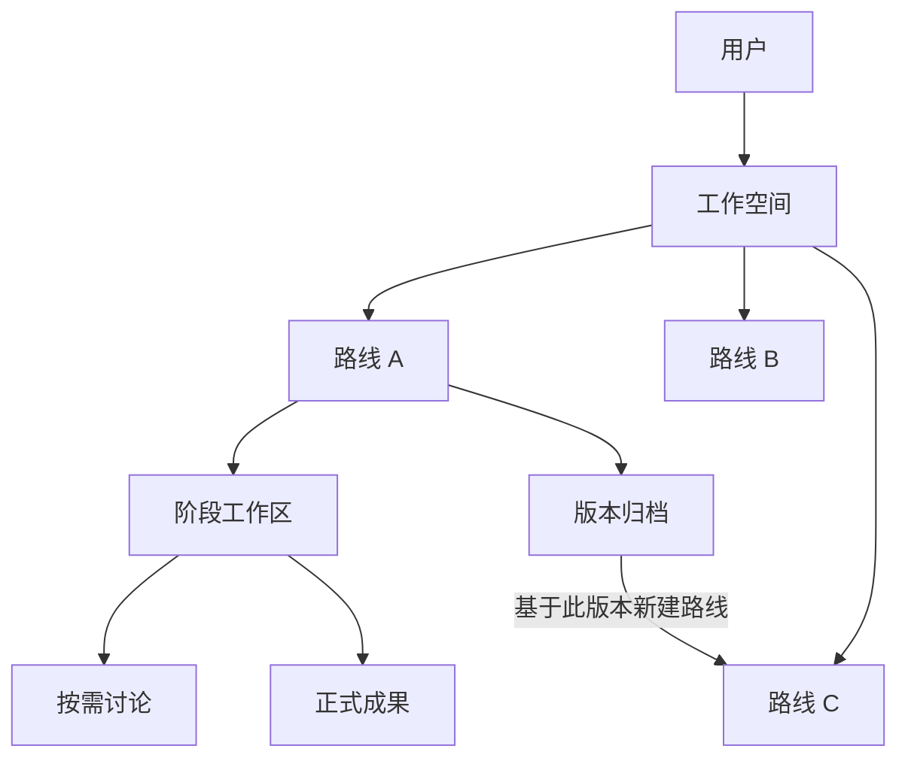

# Native Workflow Web 工作区信息架构设计

日期：2026-07-17
状态：交互设计已确认，等待书面规格终审

## 1. 设计结论

Native Workflow Web 采用以阶段工作对象为中心的统一工作区。用户不再面对“主线模式”“历史模式”或“派生模式”，系统只根据当前位置呈现工作路线或版本归档。

本设计删除两个没有独立产品价值的概念：

1. 删除“当前浏览位置的未提交笔记”。页面不再提供 Stage 级便笺或独立笔记模块。
2. 删除“派生路线”这一特殊路线类型和用户术语。所有路线地位相同、能力相同；从旧版本继续工作时创建一条普通新路线，仅保留可选来源信息。

旧版混合布局、旧文案和旧本地笔记不做兼容。内部领域契约继续使用 `Context / Route / Stage / Thread / Checkpoint / Artifact`，但 UI 统一使用“工作空间 / 路线 / 阶段 / 讨论 / 版本 / 成果”。

## 2. 与既有母模板设计的关系

本规格补充并覆盖《原生 Workflow Web UI 母模板设计》中与工作区信息架构相关的展示语义，不改变以下底层边界：

- 固定领域层级仍为 `User → Context → Route → Stage → Thread → Checkpoint`。
- Manifest 仍只声明产品信息、Stage 投影、合法动作、固定组件 key 和 Artifact 契约。
- Workflow Bridge 仍负责命令转换和结果规范化。
- Native Domain/API 仍裁决权限、执行游标、状态迁移、版本冲突和原子持久化。
- Workflow 不直接写产品数据库。
- 固定 Stage 组件仍为 `generic_chat`、`structured_form`、`card_selection`、`document_workspace`。

既有设计中出现的 `Derived Route` 应解释为“带有可选来源信息的普通 Route”，不再是产品类型、权限类型或界面模式。既有“本地未提交草稿”只保留为讨论输入框草稿，不再包含 Stage 级笔记。

## 3. 目标与非目标

### 3.1 目标

- 让具体 Workflow 的阶段任务成为页面主角，不把所有 Workflow 包装成聊天产品。
- 让路线、阶段、讨论、版本、附件和成果各自处于稳定且可预测的位置。
- 让原有路线和从版本创建的路线拥有完全相同的工作能力。
- 在桌面和移动端都保持单层、可扫描的当前任务流。
- 保留阶段自由浏览、同阶段多讨论、受控采纳、阶段推进和不可变版本历史。
- 为零兼容重构提供明确的模块可见性、数据流和测试边界。

### 3.2 非目标

- 不保留旧页面布局、旧“阶段草稿”入口或旧本地存储键的迁移逻辑。
- 不在 UI 中展示“派生路线”“派生讨论”或“当前浏览位置”等工程概念。
- 不开发多 Workflow IDE 或在一个发行版中切换多个 Workflow。
- 不改变 Manifest、Bridge 或固定组件注册表的职责边界。
- 不复制来源讨论、附件或未发送草稿到新路线。

## 4. 方案选择

### 4.1 选定方案：统一路线工作区

所有 Route 使用同一套工作区。Stage 工作对象位于中央，Thread 讨论按需进入右侧抽屉，Checkpoint 退出工作区进入只读版本归档。由版本创建的新 Route 与其他 Route 同列展示，仅在详情中提供来源链接。

该方案让用户只需要理解“我在哪条路线、哪个阶段工作”，不会因为谱系来源改变操作模型。

### 4.2 未采用方案

1. **多模式工作区**：为主线、历史和派生分别提供模式。该方案会重复控件，并要求用户先理解内部状态模型。
2. **来源对照工作区**：持续左右并排显示来源和新路线。该方案占用主要空间，并把偶尔需要的来源信息提升为永久界面结构。
3. **聊天优先工作区**：把 Thread 作为中央内容，Stage 任务退居侧栏。该方案会让表单、文档和卡片选择型 Workflow 被迫表现为聊天产品。

## 5. 用户信息架构

用户可见术语固定如下：

| 内部术语 | UI 术语 | 用户含义 |
| --- | --- | --- |
| Context | 工作空间 | 一个独立项目或问题空间 |
| Route | 路线 | 一套可独立推进的工作状态 |
| Stage | 阶段 | 当前 Workflow 的稳定业务步骤 |
| Thread | 讨论 | 某阶段中的一个独立问题讨论 |
| Checkpoint | 版本 | 受控动作后保存的不可变状态 |
| Artifact | 成果 | 已被采纳并进入正式路线状态的产出 |

“来源路线”和“来源版本”是 Route 的可选谱系元数据，不构成新的用户实体。

## 6. 路线工作区

### 6.1 工作区骨架

桌面端由三部分组成：

1. 路线与阶段导航。
2. 居中的 Stage Workspace。
3. 默认收起的 Thread 讨论抽屉入口。

Stage Workspace 根据 Manifest 的 `component_key` 渲染固定组件。页面标题、主要动作和成果区属于 Stage Workspace，讨论消息和附件不进入中央任务流。

用户浏览其他 Stage 时只改变浏览位置，不移动 execution cursor。界面通过阶段状态标记当前执行阶段、已完成阶段和未就绪阶段，不提供手动“模式”切换器。只有 Manifest 和 Native Domain 判定为合法的命名动作才可显示为可执行状态。

### 6.2 路线同权

所有 Route 使用同一实体结构、导航层级、URL 结构、Stage 组件、Thread 能力和命名动作权限。Route 不具有 `main`、`derived` 等用户可见类型。

Route 可以保存以下可选来源信息：

- `origin_checkpoint_id`
- 创建时间和创建者

来源路线由不可变的 `origin_checkpoint_id` 推导，不新增重复的路线类型或来源字段。存在来源信息时，工作区只显示一条轻量说明，例如“来源：发布准备 / 版本 03”。用户可打开来源版本，但来源面板默认不占据工作区。

## 7. 讨论与输入草稿

### 7.1 Thread 抽屉

桌面端 Thread 默认收起为右侧抽屉。抽屉顶部列出当前 Stage 的多个 Thread，并提供新建讨论入口。打开抽屉不改变 Route、Stage 或 execution cursor。

移动端 Thread 使用全屏覆盖层。关闭后返回原 Stage Workspace，并恢复原滚动位置和选择状态。

普通消息只进入当前 Thread。只有“采纳到当前路线”等受控命名动作才能更新共享 Route 状态、生成成果或创建新版本。

### 7.2 删除独立笔记

删除以下 UI 和行为：

- “当前浏览位置的未提交笔记”模块。
- “阶段草稿”文本域。
- 按 URL 或 Checkpoint 保存的独立便笺。
- 历史版本中的笔记输入能力。

讨论输入框仍保留正常的未发送草稿能力。它不是独立产品模块，只是输入保护机制：

- 草稿按 `product + user + context + route + stage + thread` 隔离。
- 切换路线、阶段或 Thread 后可恢复对应输入内容。
- 发送成功后清除；发送失败或会话暂时失效时保留。
- 草稿永不发送给 Workflow，永不进入数据库、版本、记忆提案或成果。
- 同一浏览器的其他用户不能读取当前用户草稿。
- 旧 Stage 笔记键不读取、不展示、不迁移，可以由新版本存储清理逻辑删除。

## 8. 版本归档与新建路线

Checkpoint 在 UI 中统一称为“版本”。版本归档是独立只读页面或面板，不是工作区模式。

归档版本只显示：

- 所属路线、阶段、版本号、创建时间和触发动作。
- 当时的 Stage 状态、execution cursor 摘要和正式成果清单。
- 必要的审计信息和来源关系。

归档版本不显示讨论输入框、Thread 切换、附件上传、采纳、推进或 Stage 编辑控件。

“基于此版本新建路线”是唯一继续工作入口。该操作由 Native Domain 原子完成：

1. 验证用户对 Context、来源 Route 和 Checkpoint 的权限。
2. 以版本中的共享 Route/Stage 状态和已采纳成果为新 Route 起点。
3. 写入可选的 `origin_checkpoint_id`，来源路线通过该版本推导。
4. 创建一个普通 Route，并进入相同的路线工作区。
5. 不复制来源 Thread、消息、附件、待处理提案、记忆提案或输入草稿。
6. 在来源 Stage 需要讨论时创建新的空 Thread，不生成“派生讨论”。

创建失败时不得留下半成品 Route。并发冲突保留归档页面，刷新来源版本后可重试。

## 9. 附件与成果

附件和 Artifact 不再混放：

- 上传附件属于产生它的 Thread，只在对应讨论中展示和引用。
- Workflow 返回的 `artifact_proposals` 仍是候选结果。
- 用户完成受控采纳后，Artifact 才成为当前 Route/Stage 的正式“成果”。
- 成果显示在 Stage Workspace，可被后续合法 Stage 使用，并进入 Checkpoint 快照。
- 从版本新建路线继承该版本已采纳成果的引用，不复制 Thread 附件。

## 10. 模块可见性

| 用户位置 | Stage 工作对象 | Thread | 输入草稿 | 附件 | 成果 | 编辑与推进 |
| --- | --- | --- | --- | --- | --- | --- |
| 普通路线 | 显示 | 按需抽屉 | 当前 Thread 输入框 | 当前 Thread | Stage 成果区 | 按权限允许 |
| 带来源的路线 | 显示 | 按需抽屉 | 当前 Thread 输入框 | 当前 Thread | Stage 成果区 | 按权限允许 |
| 归档版本 | 只读快照 | 隐藏 | 隐藏 | 隐藏 | 只读成果清单 | 禁止 |

带来源的路线与其他路线不存在能力差异，因此不单独形成界面模式。

## 11. 响应式与交互要求

- 桌面端 Stage Workspace 占据主要宽度，Thread 抽屉覆盖或压缩辅助区域，但不能把工作对象降为窄栏。
- 移动端一次只显示一个主要层级：路线工作区、全屏讨论或只读版本。
- 路线与阶段切换使用稳定尺寸，加载、未读标记和长名称不得引发布局跳动或文本溢出。
- Thread 抽屉入口显示讨论数量和未读状态，但不使用说明性大段文案。
- 来源信息可展开查看，默认保持轻量。
- 焦点返回、键盘操作、抽屉关闭和移动端返回行为必须可预测并满足可访问性要求。

## 12. 数据与命令边界

UI 仍只提交普通消息或 Manifest 声明的命名动作。统一工作区不会扩大 Workflow 权限：

1. Thread 消息由 Native API 校验 scope 后发送给 Workflow Bridge。
2. Workflow 结果先规范化为 reply、Stage signal、Artifact/Memory proposal 和 cursor。
3. Native Domain 校验版本、执行游标和合法迁移后原子持久化。
4. UI 根据返回的 Route、Stage、Thread 和 Checkpoint 投影刷新当前工作区。

版本归档不提交 Workflow command。“基于此版本新建路线”是 Native Domain 命令，不由 Workflow 决定是否创建 Route，也不通过在历史 Thread 中隐式提交消息触发。

## 13. 错误与边界状态

- Thread 消息失败：保留输入草稿，显示可重试错误，不创建成果或版本。
- Workflow 超时或非法结果：Thread 可显示失败状态，但共享 Route 状态保持不变。
- 采纳或推进发生 409：刷新当前 Route 头部版本，不静默覆盖。
- 新建路线发生冲突：不创建部分 Route、Thread 或来源关系。
- 来源 Route 后续推进或归档：已创建路线仍指向不可变来源版本，不受影响。
- 来源版本存在已失效成果引用：显示明确的不可用状态，不回退展示 Thread 附件。
- 刷新或容器重启：服务端工作状态恢复；同一用户的当前 Thread 输入草稿由浏览器恢复。

## 14. 验收与测试

### 14.1 组件与交互测试

- Stage Workspace 是默认主内容，Thread 初始收起。
- 同 Stage 多 Thread 可切换，消息和输入草稿互相隔离。
- 路线、阶段和 Thread 切换恢复正确草稿；成功发送后只清除对应草稿。
- 页面不存在 Stage 笔记、派生路线、派生讨论和历史模式文案。
- 附件只出现在所属 Thread，采纳后的成果只出现在 Stage 成果区。

### 14.2 领域与 API 测试

- 从版本创建的新 Route 与普通 Route 返回相同能力和资源结构。
- 新 Route 保存来源信息，但不复制 Thread、消息、附件、提案或草稿。
- 版本归档端点只读，不能提交消息或命名动作。
- 新建路线满足权限、幂等、乐观并发和事务原子性。
- 跨用户无法读取 Route、来源版本、附件或浏览器草稿。

### 14.3 浏览器与生产验收

- 桌面端验证路线切换、Stage 自由浏览、讨论抽屉、同阶段多讨论、采纳、推进、版本归档和新建路线。
- 390px 移动端验证单层工作区、全屏讨论、返回恢复和版本只读视图。
- 刷新、重新登录和生产容器重启后恢复服务端工作状态。
- 使用真实 Workflow fixture 验证正常结果、超时、非法结果、幂等重试和并发冲突。
- Playwright 截图中不得出现模块重叠、长文本溢出或旧概念入口。

## 15. 成功标准

- 用户只需要理解路线、阶段、讨论、版本和成果，不需要理解浏览模式或路线谱系类型。
- 任何 Route 无论是否带来源，都使用同一工作区并具备同等能力。
- 版本历史保持不可变和只读，继续工作必须显式创建普通新路线。
- Stage 工作对象始终是主内容，讨论不会主导非聊天型 Workflow。
- 独立 Stage 笔记彻底消失，未发送内容只存在于对应 Thread 输入框。
- 附件、候选 Artifact 和正式成果的归属清晰且可测试。
- 桌面、移动端和生产容器均有可重复执行的自动化验收证据。
