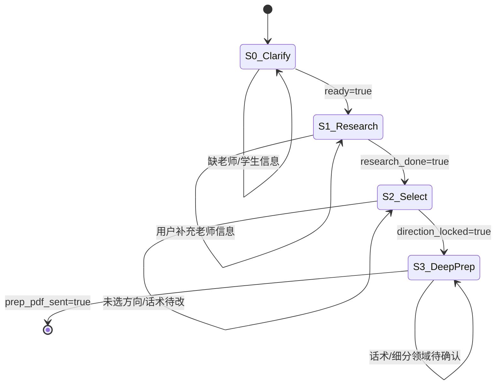

# 套辞助手 Workflow · 状态机规格

> **Harness = `taoci-outreach.lg.json` 图**  
> 架构：`PolarUI/docs/ARCHITECTURE.md`  
> 接口：**网站 Chat**（JSON 入 / JSON+PDF 出）

## 架构

```
网站用户
  ↓
PolarClaw /api/workflow/chat → PolarUI graph engine
  ↓
taoci-outreach.lg.json
  PromptInput → WorkingMemory → Switch(step)
  → LLM / SubAgent → Output
```

workflow 图内**无渠道节点**。回复和 PDF 路径通过 Output 节点 JSON 返回，由网站 Chat UI 展示。

## 状态机



### Step 0 · 澄清需求

| 字段 | 必填 | 说明 |
|------|------|------|
| `teacher.name` | ✓ | 导师姓名 |
| `teacher.institution` | 推荐 | 单位/院系 |
| `teacher.url` | 推荐 | 导师页链接 |
| `student.profile` | ✓ | 学校/专业/年级/科研/意向 |
| `student.files` | 可选 | 简历等（网站上传，未来支持） |

### Step 1 · 导师调研（3 路 SubAgent）

| SubAgent | 输出 |
|----------|------|
| `reputation` | 风评摘要 |
| `authorship` | 署名模式 |
| `directions` | 研究方向交叉点 |

### Step 2 · 选方向 + 话术 + 概览 PDF

### Step 3 · 深度准备 PDF

## PolarUI 节点图

| 节点 | 类型 | 作用 |
|------|------|------|
| 1 | PromptInput | 用户消息入站（channel=web） |
| 2 | WorkingMemory | 多轮记忆 |
| 3 | Switch | session.step 路由 |
| 4–n | LLM / SubAgent | 各 step |
| n+1 | Output | JSON 结果（含 reply、pdf_path） |

## 测试

```bash
cd PolarUI/workflows/taoci-outreach
node tests/run.mjs
```

```bash
cd ~/Polarisor/PolarUI
node lib/run-graph-cli.mjs \
  --workflow taoci-outreach \
  --conversation-id test-001 \
  --message "想套辞胡友财老师"
```

## 部署清单（网站）

1. PolarPrivate @ 12790（LLM）
2. `xelatex`（PDF）
3. PolarClaw Chat 壳 `/api/workflow/chat`
4. `PUT /api/deployments` 注册 workflow

## 飞书渠道（未来 · R5）

飞书 IM、Bot 凭证、`lib/feishu-im/` 接入 — 见 `docs/ROADMAP.md` R5。当前 workflow 不含 FeishuIM 节点。

## Claude Code Core

| 环境变量 | 默认 | 说明 |
|----------|------|------|
| `TAOCI_USE_CLAUDE_CLI` | `1` | `0` 时直连 PolarPrivate |
| `TAOCI_MOCK_LLM` | — | `1` 测试 mock |
| `TAOCI_MOCK_PDF` | — | `1` 跳过 xelatex |
