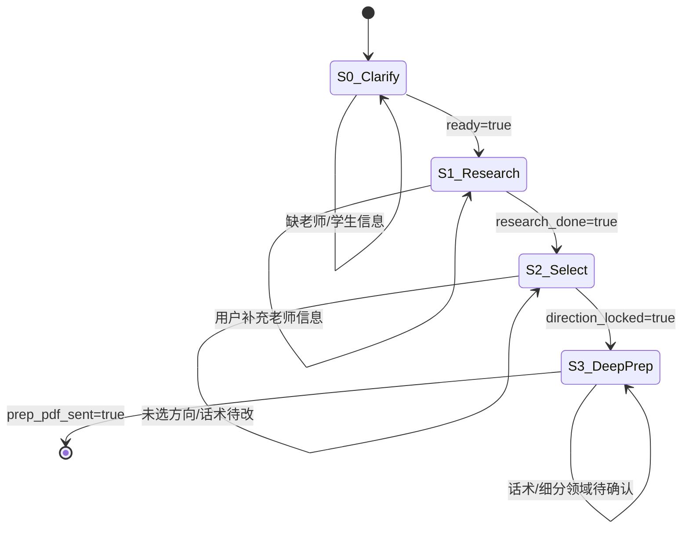

# 套辞助手 Workflow · 状态机规格

> **Harness = `taoci-outreach.lg.json` 图**（PolarUI 所见即所得）  
> 架构原则：`PolarUI/docs/ARCHITECTURE.md`  
> 接口：飞书（多文件入 / PDF 出）

## 架构（目标 — 阶段 C）

```
飞书用户
  ↓
PolarClaw @套辞 → PolarUI graph engine（executeGraph）
  ↓
taoci-outreach.lg.json
  FeishuIM/PromptInput → WorkingMemory → Switch(step)
  → LLM / SubAgent → FeishuIM → Output
```

**禁止**：外挂 harness CLI 作为生产路径（已删除，Harness = 图）。

### 与现状差距

| 项 | 现状 | 目标 |
|----|------|------|
| 图 | ✅ Switch + LLM/SubAgent 明面节点；LG 单路径执行 | — |
| PolarClaw | ✅ executeGraph via run-graph-cli | — |
| 测试 | graph-engine + huyoucai-qa 情景（图引擎） | — |

## 状态机（每步可循环，非一问一答）



### Step 0 · 澄清需求（必含）

| 字段 | 必填 | 说明 |
|------|------|------|
| `teacher.name` | ✓ | 导师姓名 |
| `teacher.institution` | 推荐 | 单位/院系 |
| `teacher.url` | 推荐 | 导师页/主页链接 |
| `student.profile` | ✓ | 结构化：学校/专业/年级/科研/意向 |
| `student.files` | 可选 | 简历、个人陈述等（飞书附件解析） |

**退出条件**：LLM Validator 判定 `ready=true` 且两必填字段非空。

### Step 1 · 导师调研（3 路 SubAgent 并行）

| SubAgent | 输出 |
|----------|------|
| `reputation` | 风评摘要、争议点、信息源 |
| `authorship` | 近五年论文署名模式、疑似抢一作/通讯异常 |
| `directions` | 近三年方向 + 与学生项目交叉点列表 |

**退出条件**：三路均 `status=done`，用户未请求「继续查」。

### Step 2 · 选方向 + 套辞话术 + 概览 PDF

- 展示 2–4 个可切入方向（含交叉点）
- 用户选择或指定
- 生成微信/飞书套辞话术（多版本可选）
- 编译 **概览 PDF**（课题 STAR + 与我衔接）

**退出条件**：`direction_locked=true` 且用户确认话术。

### Step 3 · 深度准备 PDF

针对话术中提到的**细分领域**：

- STAR 工作描述
- 所需能力/技术清单 + 学生已有/需补
- **≥10 条**模拟导师追问 + 参考短答  
  （必含：为何选该细分领域、为何能胜任）

**退出条件**：`prep_pdf_sent=true`。

## PolarUI 节点图（`taoci-outreach.lg.json`）— 目标

| 节点 | 类型 | 作用 |
|------|------|------|
| 1 | FeishuIM / PromptInput | 飞书入站 |
| 2 | WorkingMemory | conversation_id 多轮 |
| 3 | Switch | session.step 路由 S0–S3 |
| 4–n | LLM / SubAgent | 各 step 智能 |
| n+1 | FeishuIM | PDF 回传 |
| n+2 | Output | 结构化结果 |

> ✅ **图已按上表重写**（WorkingMemory → Switch → LLM/SubAgent → FeishuIM）。无 ShellExec（ADR-004）。

### FeishuIM 可复用块（`PolarUI/lib/feishu-im/`）

- **唯一必填 param**：`bot_name`（默认 `PolarClaw_Rr`）
- **PolarPrivate Secret keys**（`setup-polarprivate.sh` 已注册占位）：
  - `feishu.rr.app_id` / `app_secret` / `verification_token` / `encrypt_key`
- **PolarPrivate Identity**：
  - `feishu.rr.app_name` = `PolarClaw_Rr`
- **环境变量映射**：`FEISHU_RR_APP_ID` 等

## PolarClaw 路由

飞书 **PolarClaw_Rr** Bot 上发送 **`@套辞`** 进入本 workflow（见 `PolarClaw/src/main.ts` + `taoci-route.ts`）。

## 测试（TDD）

```bash
cd PolarUI/workflows/taoci-outreach
node tests/run.mjs          # mock LLM 链路 + 胡友财情景 QA
```

- `tests/link/` — 状态机 S0→S3、FeishuIM 配置、@套辞 路由
- `tests/scenario/huyoucai-qa.test.mjs` — 郭韵怡/胡友财多轮情景

## 部署清单

1. PolarPrivate @ 12790（LLM）
2. `xelatex`（PDF）
3. PolarClaw @ 3910 + 飞书 Bot 凭证
4. 注册 workflow：`registry.json` 增加 `taoci-outreach.lg.json`
5. PolarClaw 路由：飞书 PolarClaw_Rr Bot 发 `@套辞`
6. PolarPrivate 填写 `feishu.rr.*` Secret + `FEISHU_RR_*` env

## Graph engine smoke test

```bash
cd ~/Polarisor/PolarUI
node lib/run-graph-cli.mjs \
  --workflow taoci-outreach \
  --conversation-id test-001 \
  --message "想套辞胡友财老师，药大制药工程大三"
```

或跑完整测试套件：

```bash
cd ~/Polarisor/PolarUI/workflows/taoci-outreach
node tests/run.mjs
```
